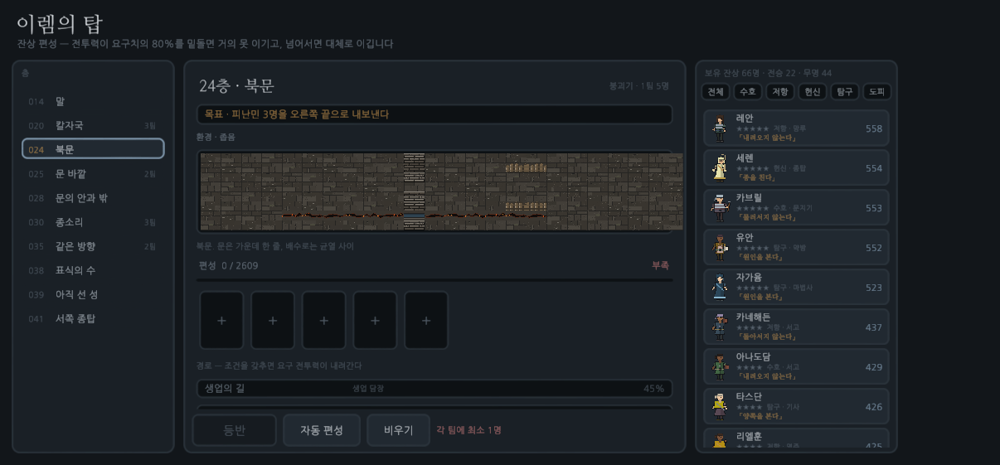
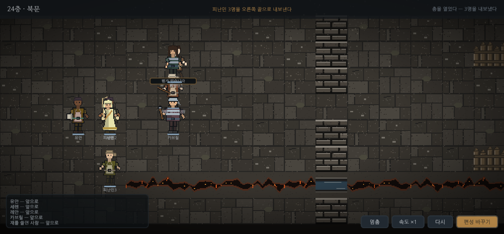

# 이렘의 탑 — 유니티

## 여는 법

> **여는 폴더는 `TOP/unity` 다. `TOP` 이 아니다.**
> 저장소 루트를 열면 유니티가 거기에 `Assets` 가 없는 것을 보고
> **빈 프로젝트를 새로 만든다.** 그러면 열려도 아무것도 나오지 않는다.
> 실수로 그랬다면 Hub 목록에서 그 항목을 지우고(Remove project),
> 루트에 생긴 `Assets/ Packages/ ProjectSettings/ Library/ Logs/ UserSettings/` 를 지운 뒤
> 다시 `TOP/unity` 를 추가하면 된다.

1. Unity Hub → **Add** → **`TOP/unity`** 폴더를 고른다 (에디터 **6000.5.10f1**).
2. 처음 열면 `Library/` 를 만드느라 몇 분 걸린다. 진행이 없어 보여도 기다린다.
3. 프로젝트가 열리면 **이렘 창**이 자동으로 뜬다. (안 뜨면 메뉴 **이렘 → 열기**, 또는 **F1**)
4. 그 창의 **▶ 재생 — 편성 화면 열기** 를 누른다.

> **씬(Scene) 탭에는 볼 것이 없다.**
> 지형도 잔상도 전부 재생할 때 만들어지고, **게임(Game) 탭**에 그려진다.
> 씬 뷰에는 카메라와 빈 오브젝트뿐이라 아무것도 없는 것처럼 보인다.
> 이렘 창의 **Game 탭 앞으로** 단추가 그 탭을 앞으로 꺼내 준다.

### 뭔가 이상하면

메뉴 **이렘 → 자체 점검**. 표·그림 73장·한글 폰트·판정·신을 한 번에 확인하고
콘솔에 ○/✕ 로 찍는다. 명령줄로도 돌릴 수 있다:

```bash
Unity -batchmode -nographics -projectPath <이 폴더> \
      -executeMethod Irem.Editor.IremSelfTest.Run -logFile -
```

이 저장소에서 실제로 돌린 결과:

```
○ 표 해석 — 잔상 66, 층 10, 프레임 28      ○ 한글 폰트 Noto Sans CJK KR
○ 시트 크기 1344×64 (기대 1344×64)         ○ 자동 편성 5명
○ 잔상 66명 그림 — 빠진 것 0               ○ 24층 전투 — 9턴, 사건 117개, 승
── 점검 통과 ──
```

빈 신에서 재생을 눌러도 된다. `IremBoot` 이 카메라·지형·잔상을 전부 세운다.
신 파일을 손으로 쓰지 않는 이유는, 손으로 쓴 YAML 이 에디터 버전이 바뀌면 깨지기 때문이다.

- **이렘 → 전투 보기** (Ctrl+Shift+I) — 다른 편성으로 다시 세운다
- 화면 오른쪽 위 단추 — 멈춤 / 빠르게 / 다시

## 무엇이 들어 있나

```
Assets/Scripts/
  Irem.Data/    Tables.cs BattleData.cs      표. 엔진을 참조하지 않는다
  Irem.Sim/     Rng ShadeGen Grid Mind Battle Setup
                                             판정. 엔진을 참조하지 않는다
  Irem.Game/    ArtLoad IremUI RosterScreen ShadeView BattleDirector IremBoot
                                             보여 주기. 여기만 엔진을 쓴다
  Irem.Editor/  IremArtImport                그림 임포트 설정 · 메뉴
Assets/Resources/Irem/
  tables.json   잔상 66 · 층 10 · 지형 9 · 수호자 3
  Shades/*.png  73장. 한 장이 28프레임짜리 시트다
  Tiles/*.png   45장
```

`Irem.Sim` 은 `noEngineReferences: true` 다. 전투 판정에 `UnityEngine` 이 한 줄도 없다.
그래서 유니티 없이 콘솔에서 그대로 돌려 검증할 수 있고, 실제로 그렇게 검증했다.

## 화면




UI 는 **uGUI + TextMeshPro** 다. IMGUI 로 그리면 유니티 에디터 툴처럼 보인다 —
그건 툴 그리는 물건이지 게임 화면이 아니다.

한글은 **나눔글꼴(OFL)을 프로젝트에 넣어** TMP 폰트 에셋으로 굽는다.
OS 폰트에 기대면 안드로이드·iOS 빌드에서 깨진다.
동적 아틀라스라 2350자를 미리 굽지 않고 쓰는 글자만 올린다.

### 화면을 찍어 확인하는 법

컴파일이 되고 오브젝트가 서 있어도, 자리가 어긋나 있으면 눈으로 봐야만 안다.

```bash
Xephyr :9 -screen 1280x800 -ac -noreset &
DISPLAY=:9 IREM_SHOTS=/tmp/shots \
  Unity -projectPath <이 폴더> -iremShots -logFile -
```

재생에 들어가 편성 화면과 전투를 네 장 찍고 스스로 끝낸다.
이 방법으로 실제로 두 가지 자리 버그를 잡았다 —
`VerticalLayoutGroup.childControlHeight` 와 `HorizontalLayoutGroup.childControlWidth` 를
끄면 `LayoutElement` 의 크기가 무시되고 각 칸이 기본 100px 을 쓴다.
목록이 세로로 늘어지고 단추가 화면 밖으로 밀려났다.

## 편성 화면

`Irem.Game/RosterScreen.cs`. IMGUI 로 그린다 — 렌더 파이프라인이 무엇이든 나오고,
프리팹도 씬 배선도 필요 없다. (폰에 낼 때는 UGUI 로 다시 짜야 한다. 지금은
에디터에서 규칙을 확인하려는 화면이다.)

| 칸 | 무엇 |
|---|---|
| 왼쪽 | 층 목록 |
| 가운데 | 목표 · 환경 · 지도 미리보기 · 팀 슬롯 · 경로 조건 · 등반 |
| 오른쪽 | 보유 잔상 66명. 역할로 거를 수 있다 |

**판정은 `Irem.Sim/Setup.cs` 하나만 쓴다.** 화면은 따로 셈하지 않는다.

- `Setup.BestRoute(f, team)` — 이 편성으로 열리는 가장 싼 길
- `Setup.Required(f, team)` — 그 길로 갈 때 져야 할 요구 전투력
- `Setup.TeamPower(team)`
- `Setup.BuildBattle(T, f, seed, teams)` — 팀을 넘기면 그 편성으로, 안 넘기면 자동 편성

## 마음 — 잔상마다 하나씩

`Irem.Sim/Mind.cs`. 이것이 에이전트다.

| 타고난 것 | 어디서 오나 |
|---|---|
| `Nerve` 겁의 크기 | 성향의 `retreat` 무게. 「물러서지 않는다」는 0.08 |
| `Zeal` 나서는 성질 | `attack + advance + ring` |
| `Care` 챙기는 성질 | `heal + guard` |

| 생기는 것 | 언제 |
|---|---|
| `Fear` 두려움 | 맞을 때, 제 편이 흐려지는 것을 볼 때 |
| `Resolve` 결의 | 매 턴 조금씩. 빚이 있으면 더 |
| `Fatigue` 피로 | 매 턴 |
| `Grudge` 원한 | 나를 친 상대를 기억한다. 다음 표적이 된다 |
| `Debt` 빚 | 나를 살린 상대를 기억한다. 회복 판단이 올라간다 |

`Shake = Fear − Resolve × 0.55` 만큼만 판단이 기운다. 결의가 두려움을 눌러 준다.
겁이 난다고 무조건 도망치지 않는다 — 대개는 대열 뒤(`guard`)로 붙는다.

**마음은 매 턴 새로 정하지 않는다.** 아직 아무것도 못 봤을 때는 한 번 정한 마음이
`Ttl` 턴 간다. 붙고 나면 매 순간 다시 본다. 크게 맞거나 제 편이 흐려지면 그때 접는다.

## 몸 — 28프레임

`Irem.Sim` 이 낸 사건을 `BattleDirector` 가 시간에 맞춰 재생하고,
`ShadeView` 가 동작을 고른다.

| 동작 | 프레임 | 초당 | 언제 |
|---|---|---|---|
| idle | 6 | 6 | 서 있을 때. 숨을 쉰다 |
| walk | 8 | 12 | 칸을 옮길 때 |
| attack | 6 | 14 | 칠 때. 당겼다가 내지른다 |
| hurt | 3 | 12 | 맞을 때 |
| fall | 5 | 8 | 흐려질 때. 마지막 프레임에서 멈춘다 |

그림은 `tools/rig.py` 가 만든다. 관절이 있는 몸에 자세를 넣어 프레임을 뽑는다.
계층이 옷을, 생업이 손에 든 것을, 성향이 자세를 정하고,
피부·머리·옷 물은 id 시드로 정해져 **같은 사람은 언제 돌려도 같은 얼굴**이다.

## 그림을 다시 만들 때

```bash
python3 tools/build_proto.py     # 시험판(HTML)
python3 tools/export_unity.py    # 유니티 (Resources/Irem 을 통째로 다시 쓴다)
```

시험판과 유니티가 **같은 표**를 읽는다. 표가 갈라지면 둘 다 틀린 것이다.

## 검증

`Irem.Sim` 은 엔진이 없으므로 콘솔에서 그대로 돌아간다.

```
층별 100판 · 오류 0
        시험판(JS)   유니티(C#)
 14층      89%         85%
 20층     100%        100%
 24층     100%        100%
 25층     100%        100%
 28층      96%         94%
 30층      90%         88%
 35층     100%        100%
 38층     100%        100%
 39층     100%         99%
 41층     100%        100%
```

편성 화면이 내는 값도 시험판과 같다.
28층 자동 편성 → 전투력 2740 / 요구 1670 (`era` 0.60), 30층 → 팀마다 1600 (`guard` 0.70).

사람이 짠 편성으로도 확인했다 (역할 하나씩, 60판, 오류 0):
**24층 100% · 41층 97% · 28층 33%.**
28층이 낮은 것은 그 편성이 `era` 조건을 못 채워 요구치가 1670 에서 2784 로 오르기
때문이다 — 편성이 승패를 가른다는 설계가 그대로 나온 것이다.

남은 2~4%p 차이는 난수(`Math.random` 대 xorshift64)와 동점 처리다.
길찾기는 우선순위 큐 대신 시험판과 같은 SPFA 로 맞췄다 —
값이 같은 길에서 다른 쪽을 고르면 같은 규칙인데 다르게 움직인다.
